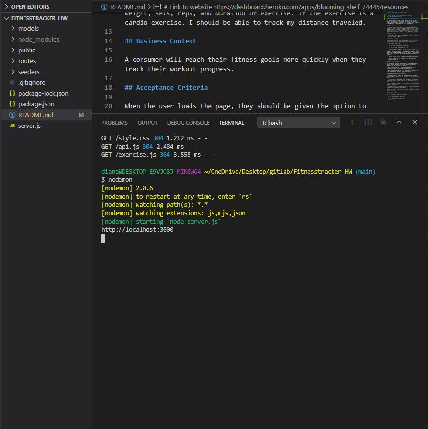
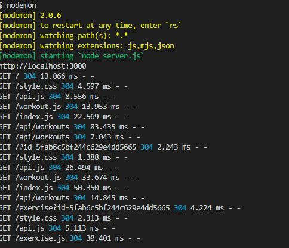
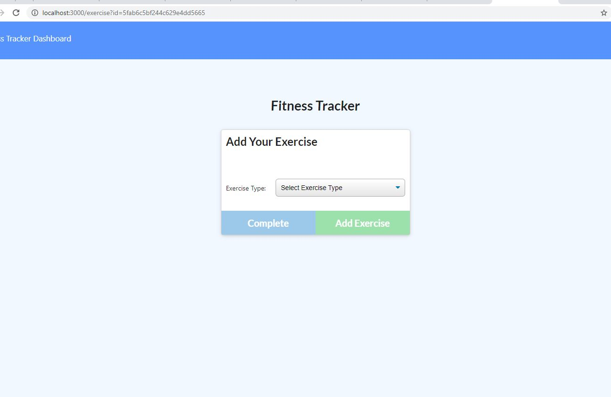
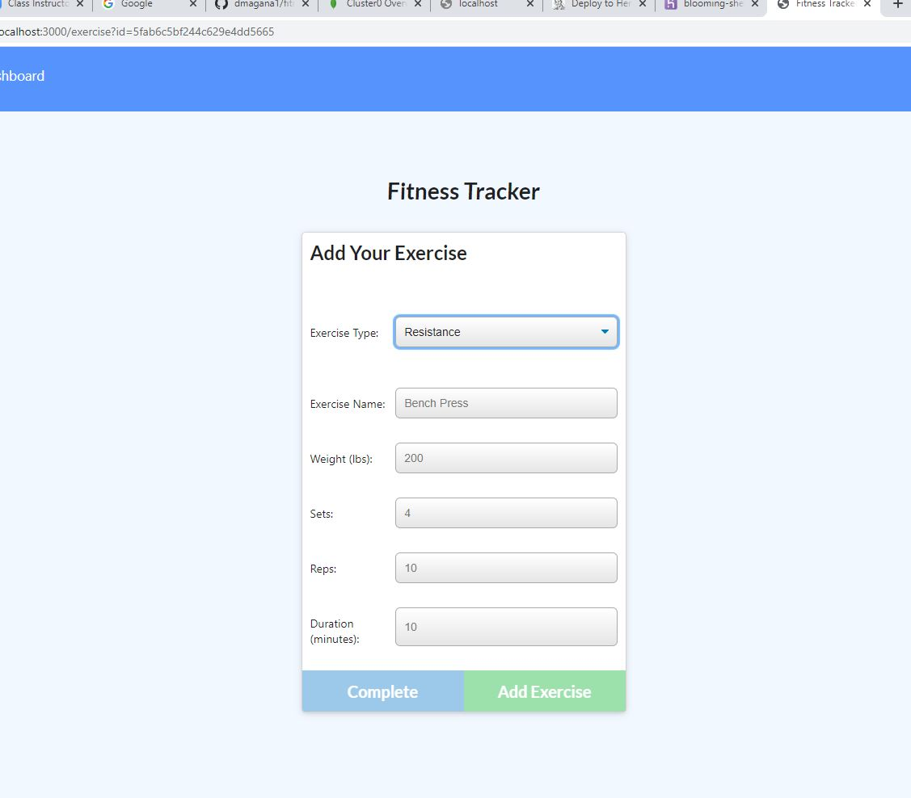
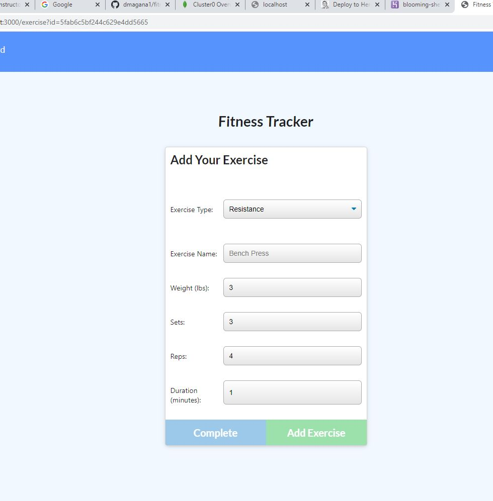

# Workout Tracker

## Description 
This assignment is about creating a workout tracker with Mongo Database and schema. The user wants to be able to log in multiple exercises and include name, type, weight, sets, reps, and how long the workout was, including distace. 

## Problems 
As of 11/10/20 Mlab no longer exist, and I am not sure what to do to make the project work in Heroku. They do have another Mongo Database App you can buy on Heroku, I believe for $49.99, but I dont know if that will do the same thing as Mlab did. I was thinking about coverting my proejct over to Mysql Database and adding Jawsdb to Heroku, but I wasnt if it would get graded correctly.

## Link To Project
Click the link here to view video of the application working https://drive.google.com/file/d/1uYJXBNISS7j97tY35JkJMMyqrUjcVof4/view
If you click the link it will take you the the application on Heroku, but it will not work do to Mlab no longer being in service  https://dashboard.heroku.com/apps/blooming-shelf-74445/resources

## Pictures
#### This is picture of the command line everytime name, type, weight, sets, reps, and long time is entered into the application on the localhost

#### First Page of Application

#### Adding information in the application

